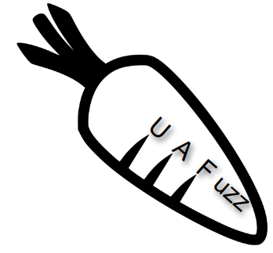

## UAFuzz: Binary-level Directed Fuzzing for Use-After-Free Vulnerabilities

**Directed Greybox Fuzzing** (DGF) like [AFLGo](https://github.com/aflgo/aflgo) aims to perform stress testing on pre-selected potentially vulnerable target locations, with applications to different security contexts: (1) bug reproduction, (2) patch testing or (3) static analysis report verification. There are recently more research work that improved directed fuzzing's effectiveness and efficiency (see [awesome-directed-fuzzing](https://github.com/strongcourage/awesome-directed-fuzzing)).

We propose **UAFuzz** which is a *directed fuzzer dedicated to Use-After-Free (UAF) bugs at binary-level* by carefully tuning the key components of directed fuzzing to meet specific characteristics of this bug class. UAF bugs appear when a heap element is used after having been freed. Detecting UAF bugs is hard: (1) **complexity** because a Proof-of-Concept (PoC) input needs to trigger a sequence of three events – alloc, free and use – on the same memory location, spanning multiple functions of the tested program and (2) **silence** with no segmentation fault.

Overall, UAFuzz has the similar workflow as directed fuzzers with our modifications highlighted in orange along the whole fuzzing process, as shown in the following figure. As we focus on (1) bug reproduction and (2) patch testing applications, it is more likely we have *(mostly) complete stack traces* of all memory-related UAF events. Unlike existing general directed approaches where targets could be selected independently, we take into account *the relationship among targets* (e.g., the ordering which is essential for UAFs) to improve the directedness. First, the static precomputation of UAFuzz is *fast* at binary level. Second, we introduce *new ordering-aware input metrics* to guide the fuzzer towards targets at runtime. Finally, we *triage only potential inputs* covering all targets in the expected trace and *pre-filter for free* inputs that are less likely to trigger the bug.

  

More details in our [paper](./raid20-final286.pdf) at RAID'20 and our [talk](https://www.blackhat.com/us-20/briefings/schedule/#about-directed-fuzzing-and-use-after-free-how-to-find-complex--silent-bugs-20835) at Black Hat USA'20. Thanks also to Sébastien Bardin, Matthieu Lemerre, Prof. Roland Groz and especially Richard Bonichon ([@rbonichon](https://github.com/rbonichon)) for his help on Ocaml.

## Installation
- [IDA Pro v6.9 and v7.6](https://www.hex-rays.com/products/ida/) (32-bit) and Python v2.7 (we aim to support more open-source binary disassemblers like Radare in the future).
- [Graph-Easy v0.7.6](https://metacpan.org/pod/Graph::Easy) for converting IDA's call graph into dot format.
- The profiling tool [Valgrind](https://valgrind.org/).
- The binary analysis framework [BINSEC](https://github.com/binsec/binsec).
- Coverage-guided greybox fuzzer [AFL v2.52b](https://lcamtuf.coredump.cx/afl/) in QEMU mode.

Our tested environment is Ubuntu 16.04 64-bit.
~~~bash
# Install Ocaml and prerequisite packages for BINSEC via OPAM
sudo apt update
sudo apt update
sudo apt install ocaml ocaml-native-compilers camlp4-extra opam emacs llvm-6.0-dev pkg-config protobuf-compiler libgmp-dev libzmq3-dev cmake valgrind
opam init
opam switch 4.05.0
opam depext conf-m4.1
opam install merlin ocp-indent caml-mode tuareg menhir ocamlgraph ocamlfind piqi zmq.5.0.0 zarith llvm.6.0.0
eval `opam config env`

# Install Python's packages (Python 2 for IDA's scripts)
sudo python -m pip install networkx pydot
sudo apt install graphviz

# Install Graph Easy
wget https://cpan.metacpan.org/authors/id/S/SH/SHLOMIF/Graph-Easy-0.76.tar.gz 
tar xzf Graph-Easy-0.76.tar.gz
cd Graph-Easy-0.76
perl Makefile.PL; make test; sudo make install
export GRAPH_EASY_PATH=/usr/local/bin/graph-easy

# Checkout source code
git clone https://github.com/strongcourage/uafuzz.git

# Environment variables
export IDA_PATH = /path/to/ida-6.9/idaq
export GRAPH_EASY_PATH=/path/to/graph-easy
cd uafuzz; export UAFUZZ_PATH=`pwd`

# Compile source code
./scripts/build.sh uafuzz

# Help for IDA/UAFuzz interface
./binsec/src/binsec -ida-help
./binsec/src/binsec -uafuzz-help
~~~

## Code structure
Our fuzzer is built upon AFL v2.52b in QEMU mode for fuzzing and BINSEC for lightweight static analysis (see [uafuzz/README.md](./binsec/src/uafuzz/README.md)). We currently use IDA Pro v6.9 to extract control flow graphs (CFGs) and call graph of the tested binary (see [ida/README.md](./binsec/src/ida/README.md)).
~~~
uafuzz
├── binsec/src
│   └── ida: a plugin to import and process IDA's CFGs and call graph
│   └── uafuzz: fuzzing code
│   │   └── afl-2.52b: core fuzzing built on top of AFL-QEMU
│   │   └── uafuzz_*.ml(i): a plugin to compute static information and communicate with AFL-QEMU
└── scripts: some scripts for building and bug triaging
~~~

## Application 1: Bug reproduction
We first consider a [simple UAF bug](./tests/example/example.c). Both AFL-QEMU and even directed fuzzer AFLGo with targets at source-level can't detect this bug within 6 hours, while UAFuzz can detect it within minutes with the help of a [Valgrind's UAF report](./tests/example/example.valgrind).
~~~bash/
# Run AFL-QEMU
$UAFUZZ_PATH/tests/example.sh aflqemu 360
# Run AFLGo given targets at source-level
$UAFUZZ_PATH/tests/example.sh aflgo 360
# Run UAFuzz
$UAFUZZ_PATH/tests/example.sh uafuzz 360 $UAFUZZ_PATH/tests/example/example.valgrind
~~~

For real-world programs, we use the [UAF Fuzzing Benchmark](https://github.com/strongcourage/uafbench) for our evaluations.
~~~bash
# Checkout the benchmark
git clone https://github.com/strongcourage/uafbench.git
cd uafbench; export UAFBENCH_PATH=`pwd`
~~~

We show in details how to run UAFuzz for bug reproduction application of [CVE-2018-20623](https://sourceware.org/bugzilla/show_bug.cgi?id=24049) of readelf (Binutils). The stack traces of this UAF bug obtained by Valgrind are as follows:
~~~
    // stack trace for the bad Use
    ==5358== Invalid read of size 1
    ==5358==    at 0x40A9393: vfprintf (vfprintf.c:1632)
    ==5358==    by 0x40A9680: buffered_vfprintf (vfprintf.c:2320)
    ==5358==    by 0x40A72E0: vfprintf (vfprintf.c:1293)
[6] ==5358==    by 0x80AB881: error (elfcomm.c:43)
[5] ==5358==    by 0x8086217: process_archive (readelf.c:19409)
[1] ==5358==    by 0x80868EA: process_file (readelf.c:19588)
[0] ==5358==    by 0x8086B01: main (readelf.c:19664)
    
    // stack trace for the Free
    ==5358==  Address 0x4221dc0 is 0 bytes inside a block of size 80 free'd
    ==5358==    at 0x402D358: free (in /usr/lib/valgrind/vgpreload_memcheck-x86-linux.so)
[4] ==5358==    by 0x8086647: process_archive (readelf.c:19524)
[1] ==5358==    by 0x80868EA: process_file (readelf.c:19588)
[0] ==5358==    by 0x8086B01: main (readelf.c:19664)
  
    // stack trace for the Alloc
    ==5358==  Block was alloc'd at
    ==5358==    at 0x402C17C: malloc (in /usr/lib/valgrind/vgpreload_memcheck-x86-linux.so)
[3] ==5358==    by 0x80AD97E: make_qualified_name (elfcomm.c:906)
[2] ==5358==    by 0x8086350: process_archive (readelf.c:19435)
[1] ==5358==    by 0x80868EA: process_file (readelf.c:19588)
[0] ==5358==    by 0x8086B01: main (readelf.c:19664)
~~~

### 1. Preprocessing
The [preprocessing script](./scripts/preprocess.py) takes the tested binary in x86 and the Valgrind's stack traces as inputs, then generates the UAF bug trace which is a sequence of target locations in the format `(basic_block_address,function_name)` like the following:
~~~
[0] (0x8086ae1,main) -> [1] (0x80868de,process_file) -> [2] (0x808632c,process_archive) -> 
[3, alloc] (0x80ad974,make_qualified_name) -> [4, free] (0x808663a,process_archive) -> 
[5] (0x808620b,process_archive) -> [6, use] (0x80ab86a,error)
~~~

### 2. Fuzzing
We provide a fuzzing script's template with several input parameters, for example the fuzzer we want to run, the timeout in minutes and the predefined targets (e.g., extracted from the bug report). For the example above, we use the script [CVE-2018-20623.sh](https://github.com/strongcourage/uafbench/blob/master/CVE-2018-20623.sh) and run UAFuzz as:
~~~bash
# Run UAFuzz with timeout 60 minutes
$UAFBENCH_PATH/CVE-2018-20623.sh uafuzz 60 $UAFBENCH_PATH/valgrind/CVE-2018-20623.valgrind
~~~

### 3. Triaging
After the fuzzing timeout, UAFuzz can identify which inputs cover in sequence all target locations of the expected UAF bug trace (e.g., input name that ends with `',all'`). Thus, UAFuzz only triages those kinds of inputs that are likely to trigger the desired bug by using existing profiling tools like Valgrind or AddressSanitizer.

## Application 2: Patch testing
We use [CVE-2018-6952](https://savannah.gnu.org/bugs/index.php?53133) of GNU Patch to illustrate the importance of producing different unique bug-triggering inputs to favor the repair process. There was a double free in GNU Patch which has been fixed by developers ([commit `9c98635`](https://git.savannah.gnu.org/cgit/patch.git/commit/?id=9c986353e420ead6e706262bf204d6e03322c300)). However, by using the stack traces of CVE-2018-6952, UAFuzz discovered [an incomplete bug fix CVE-2019-20633](https://cve.mitre.org/cgi-bin/cvename.cgi?name=CVE-2019-20633) of the latest version 2.7.6 (commit `76e7758`), with a slight difference of the bug trace. Overall, the process is similar to the bug reproduction application, except that some manual work could be required in identifying target UAF bug trace. We use PoC inputs of existing bugs and valid files in [fuzzing-corpus](https://github.com/strongcourage/fuzzing-corpus) as high quality seeds.
~~~bash
# Fuzz patched version of CVE-2018-6952
$UAFBENCH_PATH/CVE-2019-20633.sh uafuzz 360 $UAFBENCH_PATH/valgrind/CVE-2018-6952.valgrind
~~~

## Application 3: Static analysis report verification
A possible hybrid approach is to combine UAFuzz with [GUEB](https://github.com/montyly/gueb) which is the only binary-level static analyzer written in Ocaml for UAF. However, GUEB produces many false positives and is currently not able to work properly with complex binaries. So we currently improve and integrate GUEB into BINSEC and then use targets extracted from GUEB's reports to guide UAFuzz. Stay tuned!
